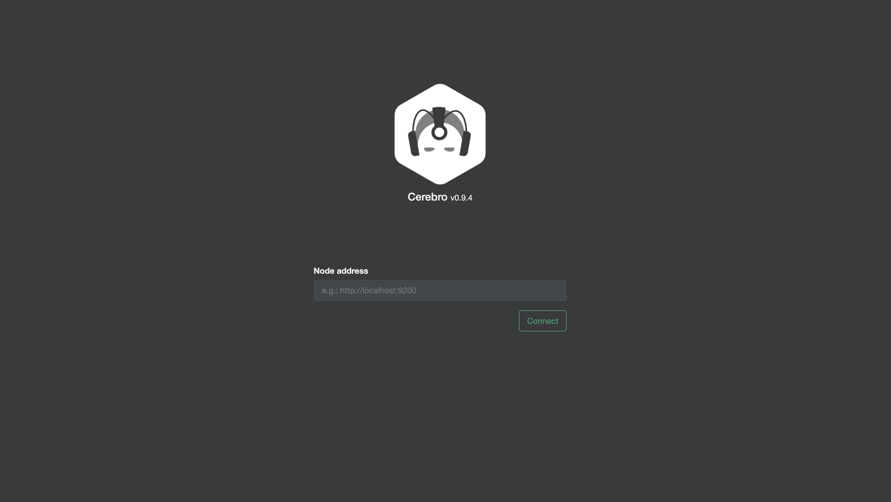
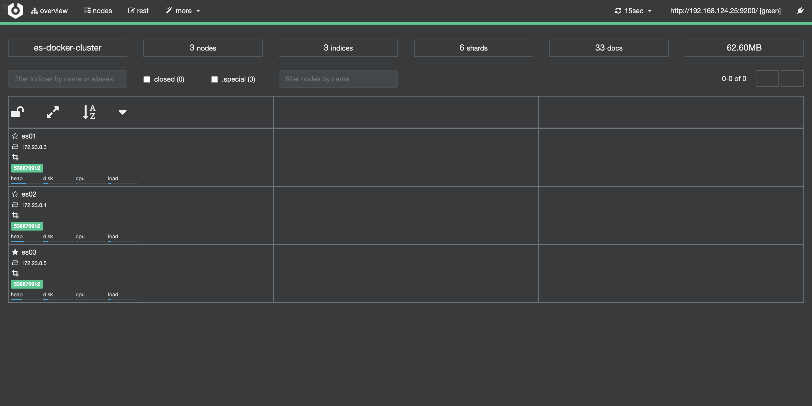
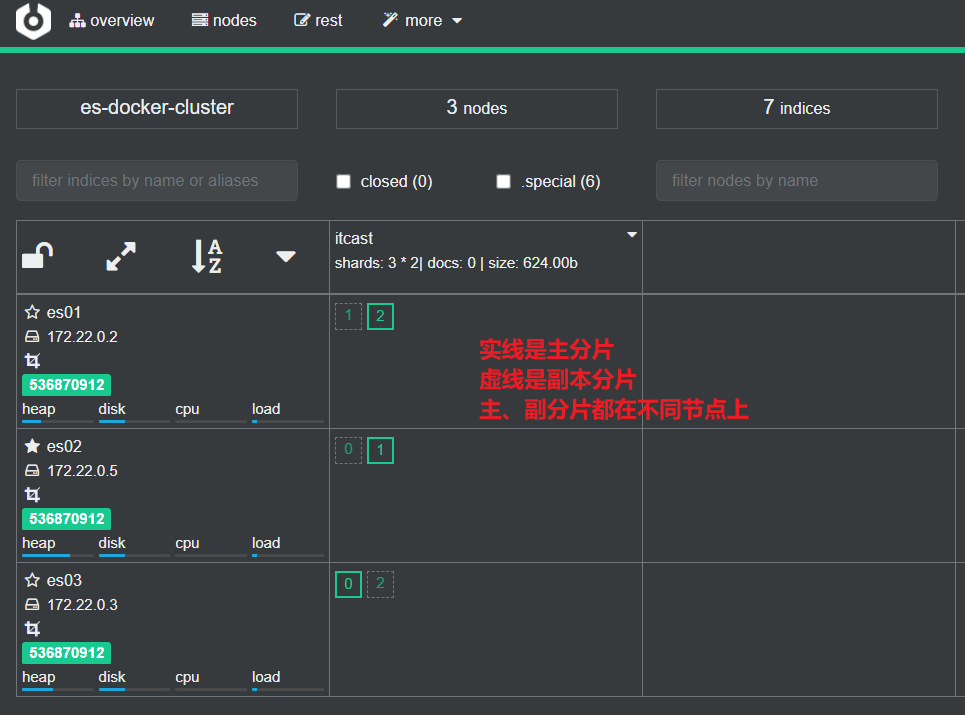

# 准备工作

本人使用的的 MacBook ，流程如下，不过其他电脑也大同小异，无非就是目录不同。

- 新建 es 所需的目录

```shell
mkdir -p ~/docker/elasticsearch/
cd docker/elasticsearch/
mkdir data
mkdir config
mkdir plugins

cd config   
echo "http.host: 0.0.0.0" >> elasticsearch.yml

##给权限
chmod 777 -R elasticsearch/data/
```

# 创建Docker网络

```shell
# 创建一个名为 es-net 的网络
docker network create es-net  
```


# 安装 ElasticSearch

- 安装 ES 完整命令如下

  > - 这里要根据自己电脑的性能来设置内存的大小，也就是 ES_JAVA_OPTS 的配置。
  >
  > - 映射的目录要跟你创建的本地目录一致，不然会有各种各样的问题。

```shell
docker run -itd -p 9200:9200 -p 9300:9300 \
  -e "discovery.type=single-node" \
  -e ES_JAVA_OPTS="-Xms512m -Xmx512m" \
  -v ~/docker/elasticsearch/config/elasticsearch.yml:/usr/share/elasticsearch/config/elasticsearch.yml \
  -v ~/docker/elasticsearch/data:/usr/share/elasticsearch/data \
  -v ~/docker/elasticsearch/plugins:/usr/share/elasticsearch/plugins \
  --network es-net \
  --name es \
elasticsearch:7.16.3
```

- 测试：浏览器访问：http://127.0.0.1:9200


# 安装 Kibana

- 安装 Kibana 完整命令如下

```shell
# 注意这里的 HOSTS 写法是因为已经将ES和Kibana放在同一个网络下
docker run -d \
  --name kibana \
  --network es-net \
  -e ELASTICSEARCH_HOSTS="http://es:9200" \
  -p 5601:5601 \
kibana:7.16.3
```

测试：浏览器访问：http://127.0.0.1:5601


# 安装 ik 分词器

es中自带的分词器对中文支持得不好，一般使用 ik 分词器(https://github.com/infinilabs/analysis-ik)

可以从这里下载打包的插件：https://release.infinilabs.com，下载后解压，将解压后的文件夹，拷贝到 ~/docker/elasticsearch/plugins 目录(本文使用了映射)下 （别忘记给 777 权限），然后重启es镜像

> 如果es镜像重启时报错请删除 plugins 目录下的 .DS_Store 隐藏文件（ls -a 查询隐藏文件)

测试: 浏览器访问 http://127.0.0.1:5601/app/dev_tools#/console 


# 部署es集群

我们会在单机上利用docker容器运行多个es实例来模拟es集群。不过生产环境推荐大家每一台服务节点仅部署一个es的实例。

部署es集群可以直接使用docker-compose来完成，但这要求你的Linux虚拟机至少有**4G**的内存空间

## 1.创建es集群

首先编写一个docker-compose文件，内容如下：

```sh
version: '2.2'
services:
  es01:
    image: elasticsearch:7.16.3
    container_name: es01
    environment:
      - node.name=es01
      - cluster.name=es-docker-cluster
      - discovery.seed_hosts=es02,es03
      - cluster.initial_master_nodes=es01,es02,es03
      - "ES_JAVA_OPTS=-Xms512m -Xmx512m"
    volumes:
      - data01:/usr/share/elasticsearch/data
    ports:
      - 9200:9200
    networks:
      - elastic
  es02:
    image: elasticsearch:7.16.3
    container_name: es02
    environment:
      - node.name=es02
      - cluster.name=es-docker-cluster
      - discovery.seed_hosts=es01,es03
      - cluster.initial_master_nodes=es01,es02,es03
      - "ES_JAVA_OPTS=-Xms512m -Xmx512m"
    volumes:
      - data02:/usr/share/elasticsearch/data
    ports:
      - 9201:9200
    networks:
      - elastic
  es03:
    image: elasticsearch:7.16.3
    container_name: es03
    environment:
      - node.name=es03
      - cluster.name=es-docker-cluster
      - discovery.seed_hosts=es01,es02
      - cluster.initial_master_nodes=es01,es02,es03
      - "ES_JAVA_OPTS=-Xms512m -Xmx512m"
    volumes:
      - data03:/usr/share/elasticsearch/data
    networks:
      - elastic
    ports:
      - 9202:9200
volumes:
  data01:
    driver: local
  data02:
    driver: local
  data03:
    driver: local

networks:
  elastic:
    driver: bridge
```


es运行需要修改一些linux系统权限，修改`/etc/sysctl.conf`文件

```sh
vi /etc/sysctl.conf
```

添加下面的内容：

```sh
# 用于指定进程可以拥有的最大虚拟内存区域数，默认值通常为65530
vm.max_map_count=262144
```

然后执行命令，让配置生效：

```sh
sysctl -p
```

通过docker-compose启动集群：

```sh
docker-compose up -d
```


## 2.集群状态监控

kibana可以监控es集群，不过新版本需要依赖es的x-pack 功能，配置比较复杂。

这里推荐使用cerebro来监控es集群状态，官方网址：https://github.com/lmenezes/cerebro

我使用的docker安装

```shell
# 适用与苹果芯片
docker run -d -p 9000:9000 --name cerebro chanmufeng/cerebro:0.9.4
```

访问http://localhost:9000 即可进入管理界面：



输入你的elasticsearch的任意节点的地址和端口，点击connect即可：

> 需要注意的是由于cerebro运行在容器中，直接输入localhost:9200 即使通过浏览器能够访问也可能无法连接，需要保证的是在cerebro的容器中能够访问到的URL，比如这里使用的本机的IP: 192.168.124.25



绿色的条，代表集群处于绿色（健康状态）。

> es名称左边的★是主节点 ☆是候选节点


## 3.创建索引库

### 1）利用kibana的DevTools创建索引库

在DevTools中输入指令：

```json
PUT /itcast
{
  "settings": {
    "number_of_shards": 3, // 分片数量
    "number_of_replicas": 1 // 副本数量
  },
  "mappings": {
    "properties": {
      // mapping映射定义 ...
    }
  }
}
```


### 2）利用cerebro创建索引库

利用cerebro还可以创建索引库：


填写索引库信息：


点击右下角的create按钮：


## 4.查看分片效果

回到首页，即可查看索引库分片效果：



