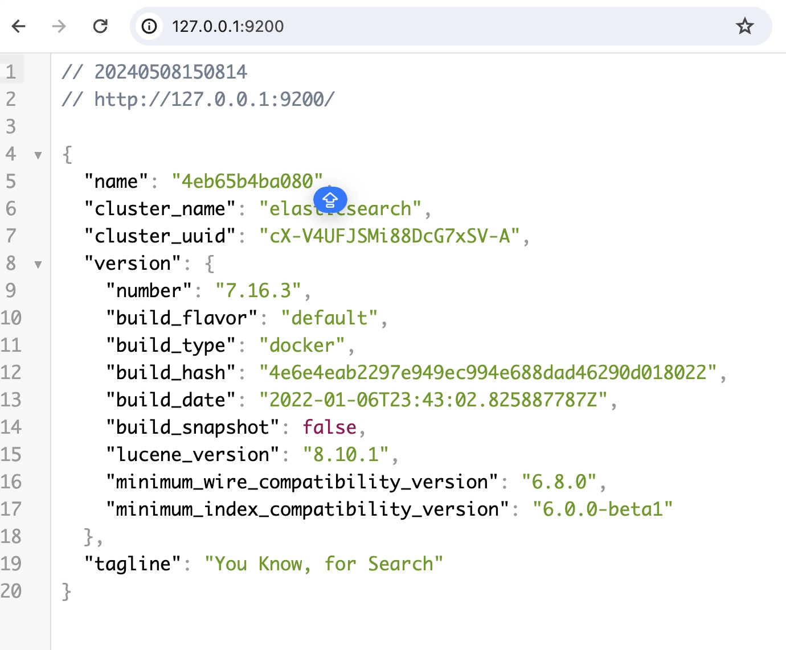
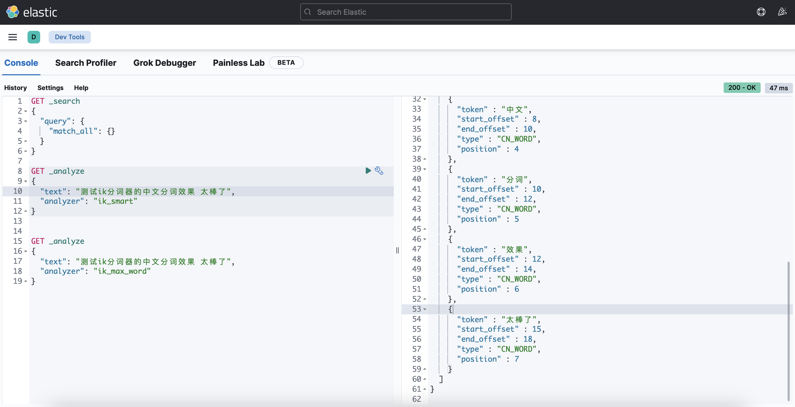
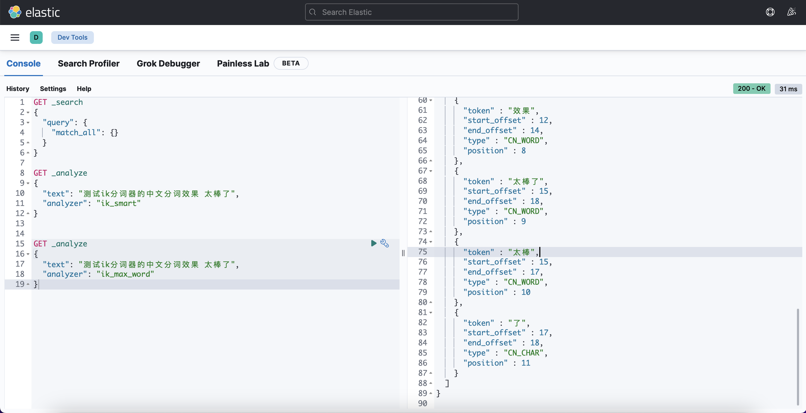

# 准备工作

本人使用的的 MacBook ，流程如下，不过其他电脑也大同小异，无非就是目录不同。

- 新建 es 所需的目录

```shell
mkdir -p ~/docker/elasticsearch/
cd docker/elasticsearch/
mkdir data
mkdir config
mkdir plugins

cd config   
echo "http.host: 0.0.0.0" >> elasticsearch.yml

##给权限
chmod 777 -R elasticsearch/data/
```

# 创建Docker网络

```shell
docker network create es-net  
```


# 安装 Elasticsearch

- 安装 ES 完整命令如下

  > - 这里要根据自己电脑的性能来设置内存的大小，也就是 ES_JAVA_OPTS 的配置。
  >
  > - 映射的目录要跟你创建的本地目录一致，不然会有各种各样的问题。

```shell
docker run -itd -p 9200:9200 -p 9300:9300 \
  -e "discovery.type=single-node" \
  -e ES_JAVA_OPTS="-Xms512m -Xmx512m" \
  -v ~/docker/elasticsearch/config/elasticsearch.yml:/usr/share/elasticsearch/config/elasticsearch.yml \
  -v ~/docker/elasticsearch/data:/usr/share/elasticsearch/data \
  -v ~/docker/elasticsearch/plugins:/usr/share/elasticsearch/plugins \
  --network es-net \
  --name es \
elasticsearch:7.16.3
```

- 测试：浏览器访问：http://127.0.0.1:9200



# 安装 Kibana

- 安装 Kibana 完整命令如下

```shell
# 注意这里的 HOSTS 写法是因为已经将ES和Kibana放在同一个网络下
docker run -d \
  --name kibana \
  --network es-net \
  -e ELASTICSEARCH_HOSTS="http://es:9200" \
  -p 5601:5601 \
kibana:7.16.3
```

测试：浏览器访问：http://127.0.0.1:5601


# 安装 ik 分词器

es中自带的分词器对中文支持得不好，一般使用 ik 分词器(https://github.com/infinilabs/analysis-ik)

可以从这里下载打包的插件：https://release.infinilabs.com，下载后解压，将解压后的文件夹，拷贝到 /Users/xxxu/Docker/elasticsearch/plugins 目录(本文使用了映射)下 （别忘记给 777 权限），然后重启es镜像

> 如果es镜像重启时报错请删除 plugins 目录下的 .DS_Store 隐藏文件（ls -a 查询隐藏文件)

测试: 浏览器访问 http://127.0.0.1:5601/app/dev_tools#/console 



